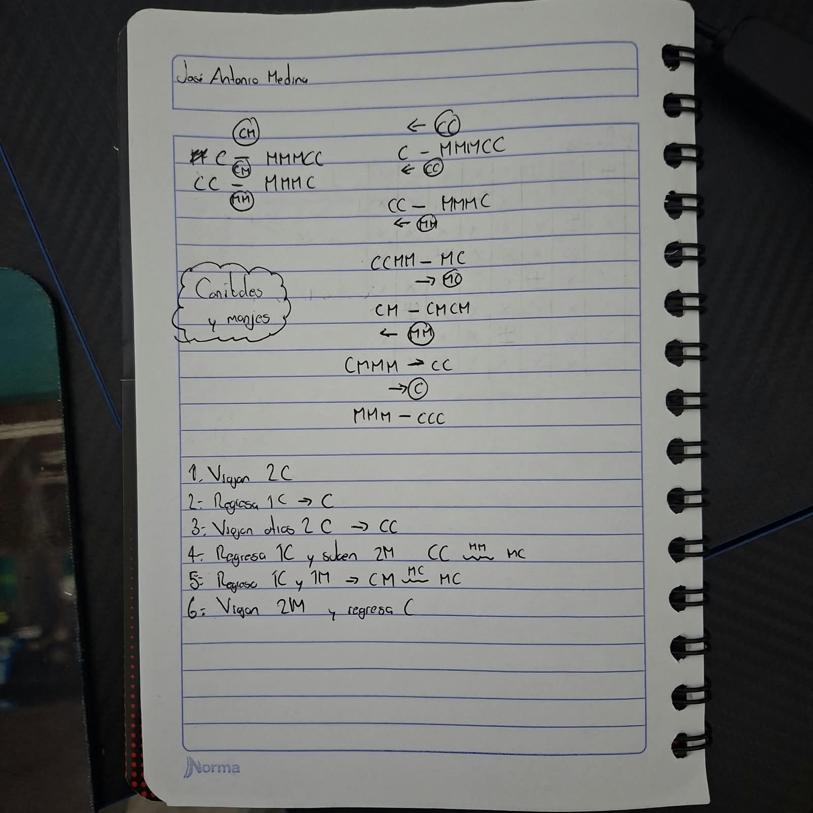
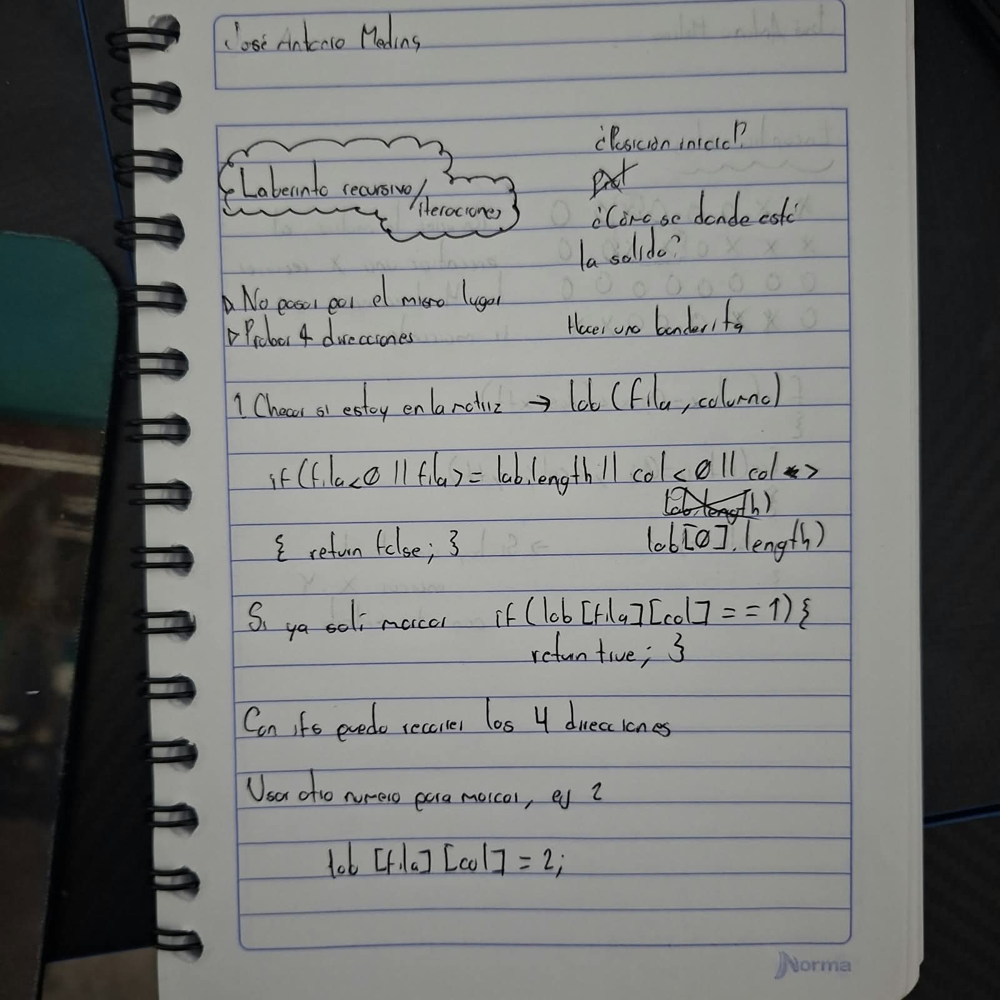
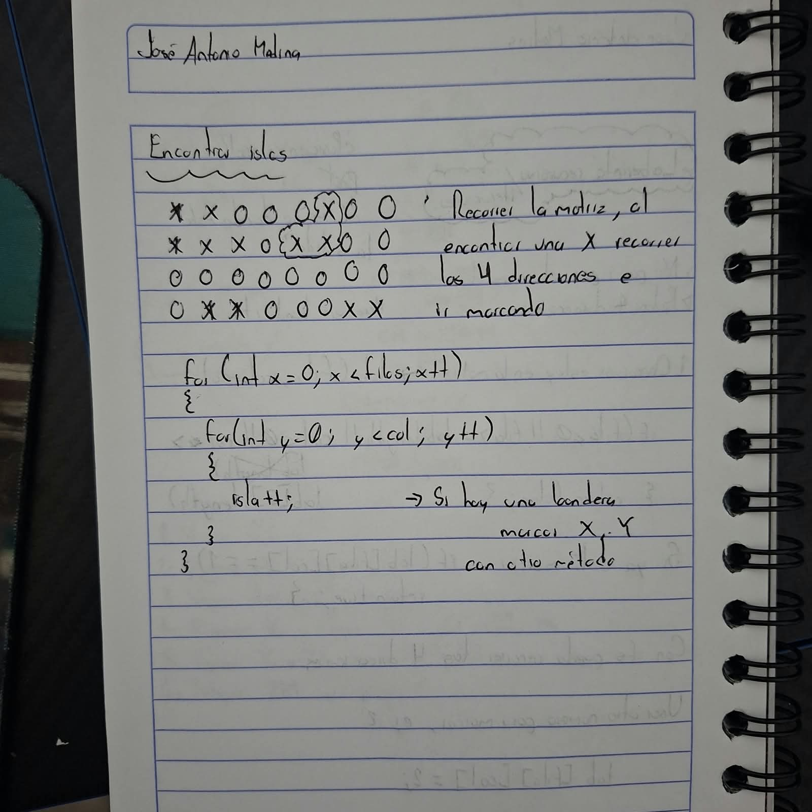

## Problemas IA - 27/08/2026
- José Antonio Medina Ayala

-----------------
### Monjes y caníbales
> **Se tienen 3 monjes y 3 caníbales de un lado de un río, se tienen que pasar al otro lado, pero no puede haber más canibales que monjes de uno, o es devorado.** 

### Laberinto recursivo/iteraciones
>**Resolver el laberinto sin importar las dimensiones que tenga la matriz que lo contenga**

### Encontrar islas
>**Se deben encontrar las islas de la medida que sea a lo largo de la matriz, pueden ser de diferentes tamaños**

